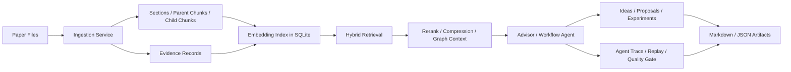

# Research Assistant Agent

Research Assistant Agent 是一个面向个人科研场景的本地可部署 RAG / Agent 工作流系统。它不是单轮 PDF 问答 Demo，而是把论文解析、证据检索、研究空白挖掘、Idea 生成、Proposal 构建、质量审查、实验规划、结果回溯和失败复盘串成一条可运行、可追踪、可复现的科研辅助流程。

## Current Distribution Target

当前分发目标是个人本地可部署科研 Agent：研究者从 GitHub clone 到本地，配置自己的模型 API Key，在个人电脑或单机服务器上运行。项目优先追求本地部署简单、数据可控、流程可解释、产物可回溯，而不是一开始就做多用户 SaaS、复杂权限系统或重型分布式基础设施。

Workbench 和 API 仍保留历史本地试用形态中的 API-key-backed and project-scope-aware pilot access 能力；在当前个人本地部署目标下，它主要用于单机访问保护、请求隔离和演示环境的操作边界。

## 这个项目解决什么问题

科研阅读和选题过程中经常会遇到几个真实问题：

- 论文很多，证据分散，读完之后很难把方法、实验、限制和可改进点系统化沉淀。
- 普通 RAG 只能回答“这篇论文说了什么”，但很难继续推进到“哪些地方值得做新工作”。
- Agent 输出经常缺少来源，生成的 Idea、Proposal、SOTA 判断难以追踪到底来自哪些论文证据。
- 检索结果好坏难以评估，一旦回答错了，很难复现当时的上下文和工具调用过程。
- 长流程任务容易中断，失败后如果只能整条重跑，会非常不适合真实使用。

Research Assistant Agent 的设计目标是把这些问题拆成工程化对象：

- 把论文解析成 section、parent chunk、child chunk、evidence、paper card。
- 把检索链路做成可评测、可回放、可定位失败原因的 RAG 管线。
- 把 Idea、Proposal、Review、Experiment、Decision Memo 等科研产物持久化。
- 把工具调用、Agent run、工作流阶段、产物 hash、配置 hash 记录下来，支持后续审计和 replay。
- 在本地 SQLite 中保存结构化状态，让个人用户可以低成本部署、备份和调试。

## 核心流程

```text
论文上传
  -> PDF / TXT / MD 解析
  -> 章节识别与 parent-child chunk 构建
  -> evidence / table / figure caption / result 信号抽取
  -> paper card 结构化
  -> 研究空白挖掘
  -> idea 生成与 novelty / collision 初筛
  -> related work matrix
  -> proposal draft
  -> reviewer critique
  -> experiment plan / benchmark packet
  -> evidence ledger / assumption audit / decision memo
  -> quality gate
  -> replay / evaluation / markdown export
```

主要入口：

```http
POST /research/workflows/literature-to-ideas
```

异步入口：

```http
POST /research/workflows/literature-to-ideas/async
```

作业、阶段和产物查看：

```http
GET /research/jobs
GET /research/jobs/{job_id}
GET /research/jobs/{job_id}/artifacts
```

Workbench 页面：

```text
http://127.0.0.1:8000/workbench
```

## 技术架构



后端以 FastAPI + SQLAlchemy + SQLite 为主。模型侧使用 OpenAI-compatible API 适配器，方便接入 DashScope、OpenAI 兼容服务或其他自建模型网关。没有配置外部模型时，部分流程会回退到本地启发式逻辑，便于开发和测试。

## RAG 能力

项目内置的 RAG 不是单一向量检索，而是面向论文任务做了多层增强。

### 分层分块与 parent-child retrieval

- 论文先被解析成 section。
- 每个 section 会保存一个章节级 parent chunk，用来保留完整上下文。
- section 内再切分成更小的 child chunk，用来做关键词召回和向量召回。
- 检索时只召回 child chunk，命中后再合并 parent chunk 上下文。

这样可以兼顾两件事：

- 召回阶段粒度小，语义匹配更精确。
- 回答和证据压缩阶段上下文足够完整，减少只命中一句话却缺少上下文的问题。

### Hybrid Retrieval

检索同时利用：

- lexical term scoring
- local hash embedding 或外部 embedding
- multi-query / query rewrite variants
- evidence、chunk、gap、idea 多对象召回
- paper filter，避免指定论文场景下串库
- diversity ranking，减少同一论文或同一章节过度挤占结果

### Rerank 与证据压缩

项目支持外部 rerank 模型。默认可以在 `auto` 模式下运行：有可用 API 时使用外部 rerank，失败时回退到稳定本地排序。

检索结果会进一步生成：

- `context_excerpt`：用于保留上下文片段
- `compressed_evidence`：用于给回答、评审和质量门控提供更短证据
- `score_breakdown`：记录 lexical、vector、phrase、rerank 等得分来源

### GraphRAG-lite

项目没有直接引入完整版 GraphRAG 框架，而是实现了轻量关系图：

- 论文、证据、gap、idea、proposal、experiment、decision 等对象会形成节点。
- support、derived_from、reviewed_by、validated_by 等关系会形成边。
- 检索时可以围绕 evidence / gap / idea 扩展相关 graph context。

它的目标不是做通用知识图谱平台，而是让科研产物之间的来源关系可追踪。

## Agent 能力

项目中的 Agent 重点不在“多角色聊天”，而在工程化闭环：

- Advisor chat 会通过受控工具读取 project cockpit、context search、idea progress、lineage、task board 等信息。
- 每次 Agent run 会记录输入、输出、模型、延迟、状态和工具调用。
- Tool call record 会保存工具名、输入输出摘要、成功失败状态和错误信息。
- Replay case 可以把失败样例保存下来，后续用脚本复现。
- Quality gate 会阻止系统在证据不足时直接做过度 SOTA 或 novelty claim。

项目也提供一个 LangGraph advisor deep-review 示例工作流，用来展示节点化 Agent 编排，但主流程仍保持稳定服务化实现，避免为了框架而重写核心业务。

## 可追溯与工程化

为了让科研 Agent 更接近真实开发场景，项目支持：

- workflow stage run：记录长流程每个阶段的状态、输入、输出和错误。
- artifact lineage：记录产物路径、hash、类型、关联 workflow 和 stage。
- failure taxonomy：把失败分成 PDF 解析、embedding provider、retrieval miss、citation mismatch、timeout 等类型。
- bad-case replay：把失败样例变成可重复执行的回归用例。
- local maintenance report：只读检查 SQLite、sidecar、表数量、向量索引数量和 trace 状态。
- benchmark packet / experiment run：把实验命令、数据集、指标、输出文件和结论结构化保存。

这些能力的目标是让系统不仅能生成答案，还能解释“为什么这样生成、来自哪里、如何复现、失败后怎么定位”。

## 为什么默认使用 SQLite

当前目标是个人本地部署，所以默认选择 SQLite：

- clone 后即可运行，部署成本低。
- 数据、向量、trace、产物索引都在本地，方便备份和迁移。
- 对个人论文库、评测集和开发调试规模足够简单直接。
- 可以直接 inspect 数据表，适合学习、面试讲解和快速迭代。

项目已经实现文档切分、embedding 入库、dense retrieval、hybrid retrieval 和 rerank。没有默认引入 Milvus / Qdrant / pgvector，是一个有意识的架构取舍：当论文规模、并发量或检索延迟成为瓶颈时，再迁移到专门向量数据库会更合理。

## 本地部署

推荐使用 Python 3.12 或更新版本。依赖、缓存、数据库、上传论文、输出文件都应保留在项目目录内。

```bash
git clone https://github.com/ImpZhang/Research-Assistant-Agent.git
cd Research-Assistant-Agent
PYTHON_BIN=/path/to/python3.12 ./scripts/setup-local.sh
source scripts/env.sh
```

启动服务：

```bash
./scripts/run-local.sh
```

或直接运行：

```bash
source scripts/env.sh
uvicorn backend.app:app --host 127.0.0.1 --port 8000
```

打开：

```text
http://127.0.0.1:8000/workbench
```

## 环境变量

复制模板：

```bash
cp .env.example .env
```

真实 key 只写入本地 `.env`，不要提交到 GitHub。

常用配置：

```env
MAIN_MODEL=qwen3-32b
MAIN_BASE_URL=https://dashscope.aliyuncs.com/compatible-mode/v1
MAIN_API_KEY=

EXTRACTION_MODEL=qwen3-32b
EXTRACTION_BASE_URL=https://dashscope.aliyuncs.com/compatible-mode/v1
EXTRACTION_API_KEY=

JUDGE_MODEL=qwen3-32b
JUDGE_BASE_URL=https://dashscope.aliyuncs.com/compatible-mode/v1
JUDGE_API_KEY=

EMBEDDER=text-embedding-v1
EMBEDDER_BASE_URL=https://dashscope.aliyuncs.com/compatible-mode/v1
EMBEDDER_API_KEY=
RETRIEVAL_EMBEDDING_PROVIDER=auto

RERANK_MODEL=qwen3-rerank
RERANK_BINDING_HOST=https://dashscope.aliyuncs.com/compatible-mode/v1
RERANK_API_KEY=
RETRIEVAL_RERANK_PROVIDER=auto
```

如果只想先跑通本地开发，可以保持 provider mode 为 `auto`，让系统在外部模型不可用时使用本地回退逻辑。真实科研使用建议配置 main、extraction、judge、embedding、rerank 这些模型能力。

## 常用命令

健康检查：

```bash
curl http://127.0.0.1:8000/health
curl http://127.0.0.1:8000/health/ready
```

运行核心测试：

```bash
bash scripts/check_context_search_evaluations.sh
bash scripts/check_research_workflow_primitives.sh
bash scripts/check_agent_replay.sh
bash scripts/check_local_safe_suite.sh
```

检查模型供应商配置，命令只报告配置状态，不输出真实 secret 值：

```bash
python3 scripts/check_model_provider_config.py
```

检查项目技能说明：

```bash
bash scripts/check_project_skills.sh
```

生成只读 SQLite 维护报告：

```bash
python3 scripts/check_sqlite_maintenance.py
```

构建本地备份清单：

```bash
python3 scripts/build_local_backup_manifest.py
```

## 验证脚本索引

仓库里的 `check_*.sh` 脚本用于不同层级的本地验证。常规开发优先跑和本次变更相关的脚本；公开发布或大改前再跑更重的 suite。

- `scripts/check_agent_replay.sh`
- `scripts/check_backup_restore_contracts.sh`
- `scripts/check_context_search_evaluations.sh`
- `scripts/check_deployment_contracts.sh`
- `scripts/check_focused_test_coverage.sh`
- `scripts/check_generated_file_guard.sh`
- `scripts/check_graph_rag_lite.sh`
- `scripts/check_handoff_docs.sh`
- `scripts/check_local_agent_readiness.sh`
- `scripts/check_local_doctor.sh`
- `scripts/check_local_geoloc_benchmark_smoke.sh`
- `scripts/check_local_operational_preflight.sh`
- `scripts/check_local_runtime_smoke.sh`
- `scripts/check_local_safe_suite.sh`
- `scripts/check_pilot_operational_preflight.sh`
- `scripts/check_pilot_readiness.sh`
- `scripts/check_product_effect_smoke.sh`
- `scripts/check_project_delivery_loop.sh`
- `scripts/check_project_skills.sh`
- `scripts/check_remote_long_suite.sh`
- `scripts/check_remote_safe_suite.sh`
- `scripts/check_research_planning_contracts.sh`
- `scripts/check_research_proposal_contracts.sh`
- `scripts/check_research_workflow_primitives.sh`
- `scripts/check_script_catalog.sh`
- `scripts/check_secret_file_guard.sh`
- `scripts/check_suite_contracts.sh`
- `scripts/check_tool_bridge_contracts.sh`
- `scripts/check_workflow_job_controls.sh`
- `scripts/check_write_audit_guardrails.sh`

## 目录结构

```text
backend/
  app.py                         FastAPI application
  research/
    adapters/                    OpenAI-compatible model adapters
    config.py                    settings and environment binding
    db.py                        SQLAlchemy engine/session setup
    models.py                    database domain models
    routes.py                    HTTP API routes
    schemas.py                   Pydantic schemas
    services/                    ingestion, retrieval, workflow, review, benchmark services

configs/
  benchmark_profiles.example.json

data/                            local SQLite database, papers, benchmark data
docs/                            design docs, runbooks, reports
outputs/                         generated reports, benchmark outputs, exported bundles
scripts/                         setup, validation, replay, benchmark, maintenance scripts
skills/                          project-local Agent skill descriptions
tests/                           pytest regression tests
```

`data/`、`outputs/`、`logs/`、`.venv/`、`.cache/`、`.env` 都是本地运行产物或私有配置，不应该作为开源内容提交。

## 文档入口

- `AGENTS.md`：本仓库的 Codex / Agent 本地开发规则。
- `TODO.md`：项目后续任务和工程 backlog。
- `codex_handoff/03_TODO.md`：历史交接中的待办整理。
- `docs/local_isolation.md`：本地隔离部署规则。
- `docs/local_agent_distribution.md`：个人本地可部署产品形态说明。
- `docs/development_process.md`：开发流程和验证习惯。
- `docs/documentation_index.md`：文档索引。
- `docs/progress_log.md`：本地开发进度记录。
- `docs/model_provider_strategy.md`：模型供应商配置策略。
- `docs/vector_store_strategy.md`：SQLite 向量存储与后续迁移策略。
- `docs/agent_replay_eval.md`：Agent replay 与评测说明。
- `docs/context_search_evaluation_plan.md`：检索评测设计。
- `docs/demo_runbook.md`：演示流程。

## 项目边界

当前版本刻意不做：

- 多用户账号体系
- SaaS 租户隔离
- 计费系统
- SSO / 企业权限
- 大规模分布式任务调度
- 默认 Milvus / Qdrant 部署
- 自动宣称 SOTA

这些不是不会做，而是与当前“个人本地科研 Agent”的目标不匹配。项目更强调本地可部署、科研流程闭环、证据可追踪和失败可复现。

## 开源与安全

在公开仓库前请确认：

- `.env` 不在 git 中。
- 真实 API Key、论文私有数据、数据库 dump、token、cookie、SSH key 不被提交。
- 只提交 `.env.example`、示例配置和不含敏感内容的文档。
- 生成的 benchmark 输出、私有论文、真实实验数据按需保存在本地 `data/` 或 `outputs/`。

如果你准备把项目作为简历项目，可以重点讲：

- 从普通 RAG 问答升级为科研决策工作流。
- parent-child chunk + hybrid retrieval + rerank + evidence compression。
- Agent trace、tool call record、bad-case replay 和 quality gate。
- workflow checkpoint、artifact lineage 和 failure taxonomy。
- local-first 架构为什么使用 SQLite，而不是一开始就引入重型向量数据库。

## License

请在正式公开前补充合适的开源许可证，例如 MIT、Apache-2.0 或其他你希望采用的协议。
