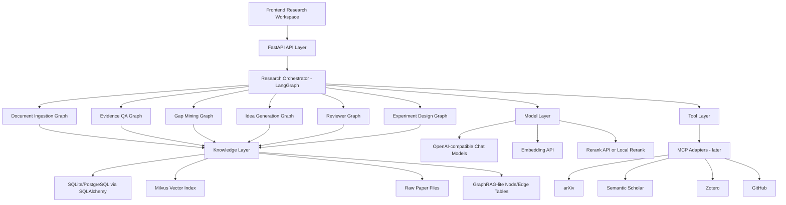
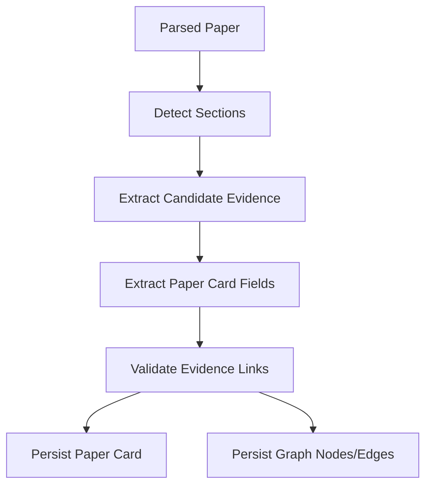

# SuperMew 科研助手技术架构与技术选型文档

版本：v0.1  
日期：2026-05-28  
状态：技术方案定稿草案  
目标项目：`/home/zhangwz/SuperMew-main`

## 1. 文档目标

本文档用于确定 SuperMew 从「RAG 文档问答」升级为「科研 idea 工作流助手」的技术架构、模块拆分、数据模型、编排方式、存储方案、技术选型、实现路线和工程边界。

配套需求文档：

- `docs/research_assistant_requirements.md`

本文档给出明确选择：

- 保留 FastAPI。
- 保留 LangChain/LangGraph。
- 保留 Milvus，但明确 Lite 与 Standalone 的使用边界。
- 新增结构化数据库层。
- 新增 Paper Card / Evidence / Gap / Idea / Review / ExperimentPlan 数据模型。
- 新增 GraphRAG-lite，而不是第一阶段接完整 GraphRAG。
- 后续接 MCP，但第一阶段不让 MCP 成为核心依赖。
- 不迁移 DeerFlow，只借鉴其长任务、多 agent、memory、tool harness 思想。

## 2. 总体技术原则

### 2.1 延续现有系统，不推倒重来

当前项目已经有：

- FastAPI。
- LangGraph。
- LangChain tools。
- Milvus。
- SSE streaming。
- RAG trace。
- 前端上传与聊天。
- 离线评测脚本。

这些都是可复用资产。升级应以新增模块和逐步替换为主，不进行大框架迁移。

### 2.2 先结构化，再智能化

如果没有结构化论文理解，idea 生成会变成普通聊天。

所以架构顺序必须是：

```text
Paper -> Section -> Chunk -> Evidence -> PaperCard -> Gap -> Idea -> Review -> ExperimentPlan
```

而不是：

```text
Chunk -> Prompt -> Idea
```

### 2.3 RAG 是底座，不是产品终点

RAG 负责找证据；科研助手负责组织科研推理流程。

技术上要区分：

- Retrieval pipeline。
- Research workflow。
- Knowledge graph。
- User-facing product state。

### 2.4 所有重要结论都要可追溯

系统输出的以下对象必须绑定 evidence：

- Paper Card 字段。
- Research Gap。
- Idea。
- Reviewer critique。
- Experiment recommendation。

### 2.5 先做 GraphRAG-lite

完整 GraphRAG 适合更大规模语料和全局知识推理。Microsoft GraphRAG 官方文档将 GraphRAG 定义为一种从原始文本中抽取知识图、构建社区层级并在查询时使用这些结构的分层 RAG 方法。这个思路很适合科研助手，但完整管线第一阶段成本偏高。

因此本项目先做轻量版：

- 显式定义科研实体。
- 显式存储实体关系。
- 在检索时做关系扩展。
- 不第一阶段引入完整 GraphRAG indexing/community summary。

参考：

- Microsoft GraphRAG: https://microsoft.github.io/graphrag/

### 2.6 MCP 核心后置，薄桥接先行

MCP 是连接外部系统的标准协议。官方文档将 MCP 定义为连接 AI 应用与外部数据源、工具和工作流的开放标准。它适合后续接 arXiv、Semantic Scholar、Zotero、GitHub 等工具，但第一阶段核心能力必须先在本地文献库内跑通。

因此完整 MCP server、外部 tool sandbox 和第三方生态接入仍然后置；当前阶段只保留一个薄的 stdio MCP-to-HTTP bridge。它读取 `/research/tools/mcp-spec`，把已有 FastAPI 能力暴露给 MCP 客户端，不引入 MCP SDK 作为核心依赖，也不复制路由清单。bridge 支持 read-only、allow/deny filter 和 health-check，便于先用最小暴露面接入外部客户端。

参考：

- Model Context Protocol: https://modelcontextprotocol.io/docs/getting-started/intro

## 3. 现有系统架构

当前主要结构：

```text
frontend/
  index.html
  script.js
  style.css

backend/
  app.py
  api.py
  agent.py
  tools.py
  rag_pipeline.py
  rag_utils.py
  document_loader.py
  embedding.py
  milvus_client.py
  milvus_writer.py
  parent_chunk_store.py
  schemas.py

data/
  documents/
  parent_chunks.json
  customer_service_history.json
  milvus/
  eval/
```

现有运行路径：

```text
前端 /chat/stream
-> backend/api.py
-> backend/agent.py
-> LangChain Agent
-> search_knowledge_base tool
-> backend/rag_pipeline.py
-> backend/rag_utils.py
-> embedding + Milvus + rerank
-> 返回 chunks + rag_trace
```

当前技术债：

- `rag_utils.py` 过大，混合了检索、rerank、heuristics、query variants、hard-coded domain bonus。
- parent chunks 用 JSON 文件保存，后续复杂关系不适合继续 JSON 堆叠。
- 会话历史用 JSON 文件保存，长期也应迁移到数据库。
- 文献结构化信息缺失。
- idea/gap/review/experiment 没有数据模型。

## 4. 目标总体架构



## 5. 技术选型总表

| 层级 | 选择 | 结论 | 原因 |
|---|---|---|---|
| Web 后端 | FastAPI | 保留 | 当前已使用；支持 OpenAPI、文件上传、SSE、BackgroundTasks；生态成熟。 |
| Agent/Workflow 编排 | LangGraph | 保留并强化 | 当前已使用；适合长流程、状态流转、可观测工作流。 |
| LLM 抽象 | LangChain + OpenAI-compatible API | 保留 | 当前模型配置已兼容 Ark/DashScope/OpenAI 风格接口。 |
| 数据校验 | Pydantic v2 | 保留 | 当前 FastAPI schema 已使用 Pydantic；适合结构化输出。 |
| 结构化数据库 | SQLite + SQLAlchemy 2.0 | 新增 | 本地部署简单，支持关系建模；未来可平滑迁移 PostgreSQL。 |
| 数据迁移 | Alembic | Phase 2 引入 | schema 稳定前可先 create_all；进入长期维护后用迁移。 |
| 向量库 | Milvus Lite dev / Milvus Standalone prod | 保留但分层 | 当前已用；Lite 适合本地小规模，但有单进程文件锁问题。 |
| 图谱存储 | SQLite node/edge tables + optional NetworkX | 新增 | GraphRAG-lite 足够；避免第一阶段上 Neo4j。 |
| 文档解析 | 现有 PyPDFLoader + 后续 PyMuPDF 增强 | 渐进 | 先复用；复杂版面再增强。 |
| 任务队列 | FastAPI BackgroundTasks + jobs 表 | MVP | 简单可靠；后续可迁移 RQ/Celery。 |
| 前端 | 当前 Vue CDN；工作台阶段迁移 Vue 3 + Vite + TypeScript | 渐进 | 不阻断后端升级；复杂 UI 时需要工程化前端。 |
| 测试 | pytest + FastAPI TestClient + Playwright | 新增 | 后端工作流、API、前端回归都需要覆盖。 |
| 外部工具协议 | MCP + stdio HTTP bridge | 薄桥接先行，完整生态后置 | MCP 适合 arXiv/Zotero/GitHub 等；当前只用 `scripts/mcp_http_bridge.py` 包装稳定 HTTP spec，避免成为核心依赖。 |
| 大型 agent harness | DeerFlow | 不迁移 | 当前系统已有主线；DeerFlow 适合长任务 harness，但迁移成本高。 |

参考：

- FastAPI: https://fastapi.tiangolo.com/
- LangGraph: https://docs.langchain.com/oss/python/langgraph/overview
- Milvus Lite: https://milvus.io/docs/milvus_lite.md
- SQLAlchemy 2.0: https://docs.sqlalchemy.org/20/
- DeerFlow: https://github.com/bytedance/deer-flow

## 6. 后端模块规划

建议新增顶层模块：

```text
backend/research/
  __init__.py
  models.py
  db.py
  schemas.py
  services/
    paper_service.py
    evidence_service.py
    graph_service.py
    retrieval_service.py
    gap_service.py
    idea_service.py
    review_service.py
    experiment_service.py
    export_service.py
  graphs/
    ingestion_graph.py
    qa_graph.py
    gap_graph.py
    idea_graph.py
    review_graph.py
    experiment_graph.py
  prompts/
    paper_card_prompts.py
    evidence_prompts.py
    gap_prompts.py
    idea_prompts.py
    review_prompts.py
    experiment_prompts.py
  adapters/
    model_adapter.py
    vector_adapter.py
    mcp_adapter.py
  evaluators/
    paper_card_eval.py
    gap_eval.py
    idea_eval.py
```

保留并逐步瘦身：

```text
backend/rag_utils.py
backend/rag_pipeline.py
backend/tools.py
```

目标是让 `rag_utils.py` 只负责通用检索，不再承载科研工作流。

## 7. 数据模型设计

## 7.1 关系数据库选择

### 选择

MVP 使用 SQLite + SQLAlchemy 2.0。

### 原因

- 远端单机部署简单。
- 当前项目已经本地文件化，SQLite 是自然升级。
- SQLAlchemy 2.0 成熟，未来迁 PostgreSQL 成本低。
- JSON 文件不适合管理多实体、多关系和查询条件。

### 后续迁移

当满足以下条件时迁移 PostgreSQL：

- 文献数量超过 1000。
- 多用户并发使用。
- 后台任务和 API 并发写入明显增多。
- 需要复杂检索/权限/事务管理。

## 7.2 核心表

### papers

```text
id
title
authors_json
year
venue
doi
arxiv_id
source_type
source_url
filename
file_path
domain
task
status
created_at
updated_at
```

### paper_sections

```text
id
paper_id
title
section_type
level
page_start
page_end
text
order_index
created_at
```

### chunks

```text
id
paper_id
section_id
chunk_id
parent_chunk_id
root_chunk_id
chunk_level
chunk_idx
page_number
text
token_count
created_at
```

### evidences

```text
id
paper_id
section_id
chunk_id
evidence_type
text
summary
supports
confidence
page_number
metadata_json
created_at
```

### paper_cards

```text
id
paper_id
problem_json
motivation_json
contributions_json
method_json
datasets_json
metrics_json
baselines_json
results_json
limitations_json
future_work_json
keywords_json
open_questions_json
extraction_model
extraction_status
created_at
updated_at
```

每个 JSON 字段结构：

```json
{
  "items": [
    {
      "text": "...",
      "evidence_ids": ["ev_xxx"],
      "confidence": 0.82
    }
  ]
}
```

### research_gaps

```text
id
title
description
gap_type
source_paper_ids_json
evidence_ids_json
why_important
why_unsolved
possible_approaches_json
feasibility_score
novelty_score
risk_level
status
created_at
updated_at
```

### ideas

```text
id
title
research_question
core_hypothesis
motivation
related_gap_ids_json
related_paper_ids_json
evidence_ids_json
method_sketch
expected_contribution
novelty_argument
datasets_json
baselines_json
metrics_json
risks_json
resource_requirements
target_venues_json
score_json
status
version
parent_idea_id
created_at
updated_at
```

### reviews

```text
id
idea_id
reviewer_type
summary
major_concerns_json
minor_concerns_json
required_experiments_json
decision
action_items_json
created_at
```

### experiment_plans

```text
id
idea_id
objective
hypothesis
datasets_json
baselines_json
metrics_json
main_experiment_json
ablation_studies_json
robustness_tests_json
expected_tables_json
failure_modes_json
fallback_plan
compute_requirements
timeline_json
created_at
updated_at
```

### experiment_runs

```text
id
experiment_plan_id
idea_id
task_id
title
status
objective_snapshot
hypothesis_snapshot
dataset_snapshot
baseline_snapshot_json
parameters_json
metric_results_json
artifact_links_json
conclusion
notes
markdown_export
created_by
started_at
completed_at
created_at
updated_at
```

### experiment_analyses

```text
id
experiment_run_id
experiment_plan_id
idea_id
task_id
decision
confidence
metric_interpretation_json
key_findings_json
concerns_json
next_actions_json
markdown_export
created_by
created_at
updated_at
```

### idea_feedback

```text
id
idea_id
decision
rating
comment
tags_json
created_by
created_at
updated_at
```

### idea_portfolio_snapshots

```text
id
title
description
ranking_request_json
idea_ids_json
ranked_items_json
markdown_export
created_by
created_at
updated_at
```

### research_briefs

```text
id
title
scope
idea_ids_json
summary_json
markdown_export
created_by
created_at
updated_at
```

### research_nodes

GraphRAG-lite 节点表：

```text
id
node_type
label
canonical_key
payload_json
created_at
updated_at
```

node_type：

```text
paper
claim
method
dataset
metric
result
limitation
future_work
gap
idea
evidence
```

### research_edges

GraphRAG-lite 边表：

```text
id
source_node_id
target_node_id
edge_type
weight
evidence_ids_json
payload_json
created_at
```

edge_type：

```text
paper_has_claim
paper_proposes_method
method_evaluated_on_dataset
paper_reports_result
paper_has_limitation
paper_suggests_future_work
gap_supported_by_limitation
idea_addresses_gap
idea_supported_by_evidence
idea_differs_from_paper
```

### jobs

用于长任务状态：

```text
id
job_type
status
input_json
output_json
error
progress
created_at
updated_at
started_at
finished_at
```

job_type：

```text
paper_ingestion
paper_card_extraction
gap_mining
idea_generation
idea_review
experiment_design
external_search
```

## 8. 向量索引设计

当前 Milvus collection 存储 chunk。后续需要两类向量对象：

1. chunks。
2. evidences。

### 8.1 短期方案

保留现有 collection：

```text
embeddings_collection
```

新增字段：

```text
object_type: chunk/evidence
paper_id
section_id
evidence_id
evidence_type
```

如果 Milvus schema 变更成本高，则新建 collection：

```text
research_evidence_collection
```

推荐做法：

- 不破坏现有 chunk collection。
- 新建 `research_evidence_collection`。

### 8.2 Milvus Lite 与 Standalone 边界

Milvus Lite 适合：

- 本地开发。
- 小规模文献库。
- 单进程调试。

Milvus Standalone 适合：

- 长期服务。
- 并发 API。
- hybrid search。
- 避免 Lite 本地 DB 文件锁问题。

当前日志中已出现过 Milvus Lite DB 文件被占用问题。因此：

- 开发时可继续 Lite。
- 远端长期服务建议切到 Docker Milvus Standalone。

## 9. 文档解析与结构化抽取

## 9.1 文档解析

MVP：

- 继续使用当前 `DocumentLoader`。
- 继续支持 PDF/Word。
- chunk 保留 page_number。

增强：

- 新增 section-aware splitter。
- 后续引入 PyMuPDF 获取更稳定的页面文本块和标题线索。
- 暂不引入 GROBID，除非需要高质量 citation/metadata 解析。

## 9.2 Section-aware 分块

现有三级分块保留，但在分块前增加章节识别：

```text
raw pages
-> section detection
-> section chunks
-> level 1/2/3 recursive chunks
```

chunk metadata：

```text
paper_id
section_id
section_type
page_number
chunk_level
chunk_idx
parent_chunk_id
root_chunk_id
```

## 9.3 Paper Card 抽取流程



### 抽取策略

按字段分批抽取：

- Abstract/Introduction -> problem, motivation, contributions。
- Method -> method, assumptions, model components。
- Experiments -> datasets, metrics, baselines, results。
- Conclusion/Limitations -> limitations, future work。

不要一次把整篇论文塞给模型。

### 输出方式

使用 Pydantic structured output。

字段必须包含：

```text
text
evidence_ids
confidence
```

## 10. LangGraph 工作流设计

LangGraph 官方文档强调它适合长时间、有状态、可持久化、可流式输出、可人工介入的 agent/workflow。科研助手正好是多阶段状态机，因此继续使用 LangGraph 是主线选择。

参考：

- LangGraph overview: https://docs.langchain.com/oss/python/langgraph/overview

## 10.1 Document Ingestion Graph

状态：

```text
paper_id
file_path
parse_result
sections
chunks
evidences
paper_card
graph_updates
errors
```

节点：

```text
parse_document
detect_sections
split_chunks
extract_evidence
extract_paper_card
validate_extraction
write_database
write_vector_index
write_graph
```

失败策略：

- parse 失败：任务失败。
- section detection 失败：降级为 page/chunk 分块。
- evidence 抽取失败：保留 chunk，标记 partial。
- paper card 部分字段失败：字段为空，记录 error。

## 10.2 Evidence QA Graph

节点：

```text
classify_question
rewrite_query
retrieve_evidence
retrieve_chunks
expand_graph_neighbors
rerank
synthesize_answer
attach_citations
```

回答格式：

```text
answer
citations
uncertainties
related_papers
trace
```

## 10.3 Gap Mining Graph

节点：

```text
select_corpus
collect_limitations
collect_future_work
collect_method_dataset_metric
cluster_gap_candidates
score_gaps
dedupe_gaps
persist_gaps
```

输入：

```text
paper_ids
topic
gap_types
```

输出：

```text
research_gaps[]
```

## 10.4 Idea Generation Graph

节点：

```text
select_gap
retrieve_supporting_evidence
generate_idea_candidates
check_prior_overlap
score_ideas
rank_ideas
persist_ideas
```

输出：

```text
ideas[]
```

## 10.5 Reviewer Graph

节点：

```text
load_idea
retrieve_related_work
novelty_review
method_review
experiment_review
feasibility_review
aggregate_decision
persist_review
```

## 10.6 Experiment Design Graph

节点：

```text
load_idea
derive_hypothesis
select_datasets
select_baselines
select_metrics
design_main_experiment
design_ablation
design_robustness_tests
estimate_resources
persist_plan
```

## 11. API 设计

新增 router：

```text
backend/research_api.py
```

或：

```text
backend/research/routes.py
```

推荐后者，避免 `api.py` 继续变大。

## 11.1 Papers

```text
POST   /research/papers/upload
GET    /research/papers
GET    /research/papers/{paper_id}
GET    /research/papers/{paper_id}/card
POST   /research/papers/{paper_id}/reextract
DELETE /research/papers/{paper_id}
```

## 11.2 Evidence

```text
GET  /research/evidence
GET  /research/evidence/{evidence_id}
POST /research/evidence/search
```

## 11.3 Gaps

```text
POST /research/gaps/mine
GET  /research/gaps
GET  /research/gaps/{gap_id}
POST /research/gaps/{gap_id}/ideas
```

## 11.4 Ideas

```text
POST /research/ideas/generate
POST /research/ideas/from-draft
GET  /research/ideas
GET  /research/ideas/{idea_id}
POST /research/ideas/{idea_id}/score
POST /research/ideas/rank
POST /research/ideas/rank/export/markdown
POST /research/ideas/portfolios
GET  /research/ideas/portfolios
POST /research/ideas/portfolios/compare
POST /research/ideas/portfolios/compare/export/markdown
GET  /research/ideas/portfolios/{portfolio_id}
GET  /research/ideas/portfolios/{portfolio_id}/export/markdown
GET  /research/ideas/portfolios/{portfolio_id}/agenda/markdown
POST /research/ideas/{idea_id}/revise
POST /research/ideas/{idea_id}/refine
POST /research/ideas/{idea_id}/related-work-matrix
GET  /research/ideas/{idea_id}/related-work-matrices
GET  /research/ideas/{idea_id}/related-work-matrices/{matrix_id}
GET  /research/ideas/{idea_id}/related-work-matrices/{matrix_id}/export/markdown
POST /research/ideas/{idea_id}/proposal-draft
GET  /research/ideas/{idea_id}/proposal-drafts
GET  /research/ideas/{idea_id}/proposal-drafts/{draft_id}
GET  /research/ideas/{idea_id}/proposal-drafts/{draft_id}/export/markdown
POST /research/ideas/{idea_id}/proposal-drafts/{draft_id}/review
GET  /research/ideas/{idea_id}/proposal-drafts/{draft_id}/reviews
GET  /research/ideas/{idea_id}/proposal-drafts/{draft_id}/reviews/{review_id}
GET  /research/ideas/{idea_id}/proposal-drafts/{draft_id}/reviews/{review_id}/export/markdown
GET  /research/ideas/{idea_id}/lineage
POST /research/ideas/{idea_id}/proposal-drafts/{draft_id}/revise
GET  /research/ideas/{idea_id}/proposal-drafts/{draft_id}/revisions
GET  /research/ideas/{idea_id}/proposal-drafts/{draft_id}/revisions/{revision_id}
GET  /research/ideas/{idea_id}/proposal-drafts/{draft_id}/revisions/{revision_id}/export/markdown
POST /research/ideas/{idea_id}/proposal-drafts/{draft_id}/revisions/{revision_id}/tasks
GET  /research/tasks
GET  /research/tasks/{task_id}
PATCH /research/tasks/{task_id}
POST /research/tasks/{task_id}/events
GET  /research/tasks/{task_id}/events
POST /research/tasks/snapshots
GET  /research/tasks/snapshots
GET  /research/tasks/snapshots/{snapshot_id}
GET  /research/tasks/snapshots/{snapshot_id}/export/markdown
POST /research/ideas/{idea_id}/review
POST /research/ideas/{idea_id}/experiment-plan
POST /research/ideas/{idea_id}/feedback
GET  /research/ideas/{idea_id}/feedback
```

当前实现中 `/refine` 是第一版 idea revision loop：它读取 reviewer actions、novelty screening、experiment plan 和父 idea，创建带 `parent_idea_id` 的新 idea version，并在 GraphRAG-lite 中写入 `idea_refines_idea` 边。后续模型增强应替换 refinement 内容生成逻辑，而不是改变这个 lineage contract。

`/related-work-matrix` 是第一版 related work screening artifact：它把一个 idea 与本地 evidence、gap、其他 idea、local/external literature search 结果做结构化对照，持久化 overlap rows、differentiators、missing searches、checked sources 和 Markdown table。它不是最终 novelty proof，而是把“像哪些已有工作、差异点应该怎么写、还缺哪些检索”变成可复查对象。

`/proposal-draft` 是第一版 proposal packaging：它读取 idea、latest 或指定的 related-work matrix、experiment plan，生成并持久化 abstract、problem statement、novelty claim、related-work positioning、method、experiment summary、risk mitigation、milestones 和 Markdown draft。它把“一个可能不错的 idea”推进到“可以被导师/组会审阅的研究草案”。

`/proposal-drafts/{draft_id}/review` 是 proposal-readiness screen：它从草案绑定的 related-work matrix、experiment plan、evidence ids 和 milestones 计算 readiness score，输出 strengths、concerns、required revisions、missing evidence 和 Markdown review。后续可以替换为多 reviewer/model 评审，但当前 contract 已经固定“草案必须可审阅、可追责、可迭代”。

`/proposal-drafts/{draft_id}/revise` 是 proposal revision loop：它读取指定或 latest readiness review，把 required revisions 和 missing evidence 转成 revised sections、applied revisions、missing-evidence actions 和 Markdown revision artifact。它不覆盖原始 draft，而是保存新 revision checkpoint，方便比较草案在多轮 review 后如何变化。

`/proposal-drafts/{draft_id}/revisions/{revision_id}/tasks` 把 revision 中的 applied revisions、missing-evidence actions 和 milestone plan 落成 `ResearchTask` backlog。`/tasks` 支持按 idea、owner type、status 查询，`PATCH /tasks/{task_id}` 支持更新 status/priority/description，让 proposal revision 进入可执行的科研任务队列。

`/tasks/{task_id}/events` 保存任务执行历史。创建 backlog 时自动写入 `created` event；`PATCH /tasks/{task_id}` 会写入 `task_updated` event；研究者或后续 agent 可以追加 `note/progress/blocker/decision/evidence` event，记录为什么任务推进、阻塞或完成。

Workbench task board 使用同一组 task API：`GET /tasks` 读取当前 idea 或全局任务，`PATCH /tasks/{task_id}` 将选中任务推进为 doing/done/blocked。它不复制 task 状态逻辑，只是给研究者一个最短路径，把自动生成的任务真正推进起来。

`/experiment-plans/{plan_id}/runs` 是第一版实验执行记录：它把 experiment plan 的一次执行落成 `ExperimentRun` artifact，保存 task id、dataset snapshot、parameters、metric results、artifact links、conclusion、notes 和 Markdown run report。创建或更新 run 会写入关联 task 的 `experiment_run_created/experiment_run_updated` event，让任务进展和实验结果在同一条执行日志里可追溯。

`/experiment-runs/{run_id}/analysis` 是第一版实验结果分析：它读取 run status、metrics、conclusion、baseline/artifact 完整性，生成 `ExperimentAnalysis` artifact，包括 decision、confidence、metric interpretation、key findings、concerns、next actions 和 Markdown report。创建 analysis 会写入关联 task 的 `experiment_analysis_created` event，后续可替换为更强 judge model 或统计检验模块。

`/experiment-analyses/{analysis_id}/tasks` 将 analysis 的 next actions 转成 `ResearchTask` backlog，owner type 为 `experiment_analysis`，并写入 `experiment_analysis_creates_task` 图边。这样系统可以从“实验结果判断”继续推进到“下一轮执行任务”。

`/ideas/{idea_id}/decision-memo` 固化 pursue/revise/park/reject 决策，自动汇总 latest feedback、novelty check、review、proposal review、experiment analysis、related-work matrix 和 open tasks，保存 rationale、evidence ids、risk register、next commitments 与 Markdown export。创建后写入 `idea_has_decision_memo` 图边，让“为什么继续/暂缓/拒绝这个方向”成为可追踪 artifact。

`/ideas/{idea_id}/decision-memos/{memo_id}/tasks` 将 decision memo 的 next commitments 转成 `ResearchTask` backlog，owner type 为 `idea_decision_memo`，并写入 `decision_memo_creates_task` 图边。这样 pursue/revise/park/reject 的判断可以立即变成可执行任务，而不是只停留在备忘录。

`/ideas/{idea_id}/assumption-audit` 生成 `IdeaAssumptionAudit` artifact，列出 assumption、why_it_matters、validation_signal、risk_level、status 和 source。默认从 core hypothesis、novelty check、related-work matrix、proposal review、experiment plan、experiment analysis、evidence ids 和 resource requirements 中构造审计项，并写入 `idea_has_assumption_audit` 图边。它用于在投入更多实验前暴露“必须为真”的条件。

`/tasks/snapshots` 固化某个 task board 状态，保存 task ids、status/priority summary、blocked tasks、next actions 和 Markdown export。它用于组会汇报、日/周复盘，以及后续自动提醒或 MCP task 工具的输入。

Proposal/workbench artifacts 会同步写入 GraphRAG-lite：`idea_has_proposal_draft`、`idea_has_novelty_check`、`novelty_check_creates_task`、`proposal_review_reviews_draft`、`proposal_revision_updates_draft`、`proposal_revision_addresses_review`、`proposal_revision_creates_task`、`idea_has_experiment_plan`、`experiment_plan_has_run`、`idea_has_experiment_run`、`task_records_experiment_run`、`experiment_run_has_analysis`、`idea_has_experiment_analysis`、`task_records_experiment_analysis`、`experiment_analysis_creates_task`、`idea_has_decision_memo`、`decision_memo_creates_task`、`idea_has_assumption_audit`、`idea_has_opportunity_radar`、`opportunity_radar_creates_task`、`task_board_snapshot_tracks_task`。这使得后续 context search、MCP tool 或 workflow planner 可以沿着 idea 的演化链路追踪到草案、novelty screen、评审、修订、执行任务、实验运行、实验结论、决策 memo、假设审计、机会雷达和下一轮 follow-up 任务。

`/ideas/{idea_id}/lineage` 将 idea 的 research plans、related-work matrices、proposal drafts、proposal reviews、proposal revisions、experiment runs、experiment analyses、decision memos、assumption audits、research tasks、task board snapshots 与 graph edge summary 聚合为一个响应，并提供 Markdown lineage export，方便前端和 MCP 一次性读取研究演化轨迹。

`/ideas/{idea_id}/progress` 将同一 idea 的 proposal、experiment、analysis、task、research plan、blocker 和 snapshot 状态聚合为进度总览，返回 artifact counts、latest artifacts、task summary、experiment summary、blockers、recommended next step 和 Markdown report。task summary 会按 owner type 和 due phase 汇总，让 plan task 能和 proposal/analysis/decision follow-up task 一起排优先级。它面向 dashboard 和 MCP planner，不替代 lineage，而是回答“下一步该干什么”。

`/ideas/{idea_id}/research-packet` 面向导师讨论、MCP tool 和外部 planner，聚合 latest artifacts、latest research plan、open tasks、graph edge summary 和 Markdown context。它不替代 lineage/progress，而是提供一个“拿来就能作为上下文”的单 idea packet，避免调用方每次自行拼接多个端点。

`/ideas/{idea_id}/timeline` 汇总 proposal、experiment、decision、assumption audit、research plan 和 task event，按时间倒序输出 `IdeaTimelineEvent` 列表和 Markdown activity log。它面向导师汇报、handoff、复盘和后续 agent 接手，回答“这个 idea 最近发生过什么”。

`/ideas/{idea_id}/readiness` 将 evidence、novelty、proposal review、experiment analysis、decision memo、assumption audit 和 task health 转成解释型 readiness score。响应包含总分、决策标签、score breakdown、blockers 和 Markdown report，用于判断是否可以继续深入执行，或者需要 targeted work、park、reject。

`/ideas/{idea_id}/readiness/tasks` 将 readiness blockers 转成 `ResearchTask` 记录，使用 `owner_type=idea_readiness`、`due_phase=readiness_follow_up`，并写入 `idea_readiness_creates_task` 图边。它让 readiness score 不只是评分报告，而能直接进入 task board、idea progress 和 research packet。

`/ideas/{idea_id}/quality-gate` 是 idea 级 go/no-go 质量门控。它读取 latest novelty check/refresh、readiness、proposal review、experiment analysis、decision memo、assumption audit 和 task health，输出 gate score、required evidence、blocking risks、recommended actions 和 Markdown report。它与 readiness 的区别是：readiness 解释“准备度”，quality gate 决策“是否继续投入资源，或先 de-risk/revise/park/reject”。

`/ideas/{idea_id}/quality-gate/tasks` 将 quality gate recommended actions 转成 `ResearchTask` 记录，使用 `owner_type=idea_quality_gate`、`due_phase=quality_gate_follow_up`，并写入 `quality_gate_creates_task` 图边。它让 go/no-go 判断直接进入 task board、idea progress 和 research packet，保证“质量门控 -> 去风险行动 -> 后续追踪”闭环。

`/ideas/{idea_id}/novelty-refresh` 复用 `NoveltyService` 与 `LiteratureSearchService`，允许传入 query override、limit 和 include_external，保存 `completed_external_novelty_refresh` 状态的 `NoveltyCheck`。它用于在 proposal、advisor brief 或 execution plan 前刷新“是否撞车”的证据，而不是只依赖 workflow 初次生成时的 novelty screen。

`/ideas/{idea_id}/novelty-checks/{check_id}/tasks` 将 novelty check 的 recommended actions 写入 `ResearchTask`，使用 `owner_type=novelty_check`、`due_phase=novelty_follow_up`，并写入 `idea_has_novelty_check` 与 `novelty_check_creates_task` 图边。它把 collision signals、missing searches 和 novelty claim 修改建议变成可追踪任务。

`/readiness/overview` 对最近 ideas 批量计算 readiness summary，返回 average readiness、decision counts、top ready ideas、needs-work ideas 和 Markdown overview。它面向 dashboard 首页和选题组合管理，帮助快速判断当前项目最值得推进的方向。

`/quality/overview` 对最近 ideas 批量运行 idea quality gate summary，返回 average gate score、decision counts、advance candidates、de-risk candidates、revision candidates、parked/rejected ideas 和 Markdown overview。它面向 portfolio 级 go/no-go 判断：不是只问“准备度高不高”，而是直接判断哪些 idea 该继续投入，哪些要先补 novelty/evidence/experiment/decision 证据。

`/quality/overview/tasks` 从 project quality gate overview 中选择指定 decision buckets（默认 de-risk/revision candidates），并复用 `ResearchTaskService.create_from_idea_quality_gate` 为多个 ideas 批量创建 `idea_quality_gate` follow-up tasks。它是导师会前或每日 triage 后的批量行动入口，避免只看 portfolio 报告而没有落地任务。

`/progress/overview` 聚合项目级进度：idea status counts、open task summary、blocked tasks、recent experiment analyses、recommended actions 和 Markdown overview。它用于 dashboard 首页和后续 MCP/agent planner 的第一跳入口。

`/triage/brief` 组合 `/progress/overview`、`/readiness/overview`、`/quality/overview` 和 `/opportunities/radar`，输出 recommended focus、risk focus、next actions 与 Markdown brief。它是更高层的“科研驾驶舱”入口：外部 agent 不需要自己拼多个 endpoint，就能拿到今天该推进什么、卡在哪里、下一步怎么做的压缩上下文。

`/triage/brief/export/markdown` 返回同一份 project triage brief 的 `text/markdown` 表示，方便导师会、纯文本备份和只消费 Markdown 的 MCP/agent 工具使用。

`/triage/brief/tasks` 将 triage brief 的 next actions 和 risk focus 写入 `ResearchTask`，使用 `owner_type=project_triage`、`due_phase=triage_follow_up`，并写入 `project_triage_creates_task` 图边。它面向每日/每轮执行：triage brief 负责判断，task endpoint 负责让判断进入任务队列。

`/opportunities/radar` 聚合 profile-aware ranking、readiness summary、open/blocked tasks 和 blockers，输出 top opportunities、risk watchlist、recommended sequence 与 Markdown report。它不是替代 ranking 或 readiness，而是把“想法是否好”和“今天该做什么”合成一个可行动视图。

`/opportunities/radar/tasks` 将 radar top opportunities 的 next actions 写入 `ResearchTask`，使用 `owner_type=opportunity_radar`、`due_phase=opportunity_follow_up`，并写入 `idea_has_opportunity_radar` 与 `opportunity_radar_creates_task` 图边。它让项目级优先级不只是报告，而能进入 task board、idea progress、lineage 和后续 agent handoff。

`/export/project-bundle` produces an `application/zip` handoff package for the whole project. It includes project triage brief, project progress overview, readiness overview, quality gate overview, opportunity radar, recent task board state, persisted advisor briefs, research execution plans, plan progress reports, and JSON metadata. It is the project-level counterpart to idea bundle export, meant for backups, advisor meetings, and downstream MCP/agent handoff.

`/briefs` 将项目级或 idea-set 状态保存为 `ResearchBrief` artifact，包含 idea list、recent experiment decisions、highest-priority open tasks、discussion prompts 和 Markdown export。它还会读取包含这些 ideas 的 research execution plans，汇总 plan task count/open/blocked/completion ratio，并加入 latest proposal review / decision memo signals。它是组会、导师沟通和后续 MCP 报告导出的稳定快照。

`/tools/manifest` 是 runtime-neutral tool registry：返回 tool name、method/path、input/output schema 和 side-effect 标记。它不要求当前服务直接运行 MCP server，但为后续 MCP adapter、DeerFlow graph node 或自研 planner 提供同一份能力契约，避免外部编排层把 FastAPI 路由写死。

外部 literature search adapter 第一阶段支持 OpenAlex、arXiv 与 Semantic Scholar。三者都通过 `EXTERNAL_LITERATURE_SEARCH_ENABLED` 控制，`EXTERNAL_LITERATURE_PROVIDERS=openalex,arxiv,semantic_scholar` 选择 provider；默认测试环境关闭外部检索，避免工作流依赖公网。

`/rank` 是第一版 portfolio selection：它按 idea score、novelty risk、review state、experiment readiness、evidence support 和 resource efficiency 生成 weighted ranking，并默认对 parent/refined lineage 去重，避免同一个方向的初稿和修订稿同时挤占候选列表。

`/rank/export/markdown` 使用同一套 ranking 参数导出选题组合报告，包含 rank、score breakdown、rationale、parent lineage、research question、hypothesis 和 method sketch，用于组会讨论、导师 review 或手动归档。

`/ideas/portfolios` 会把某次 ranking 结果保存为 immutable snapshot，固化 ranking request、ranked items、idea ids 和 Markdown report。这样后续的反馈、重排或新论文 ingestion 不会改变当时用于讨论或决策的 shortlist 记录。

`/ideas/portfolios/compare` 比较两个 saved snapshots，返回 added/removed/kept ideas、rank delta、score delta 和 Markdown comparison report，用于追踪选题组合在多轮反馈、refinement 或新增文献后的变化。

`/ideas/portfolios/{portfolio_id}/agenda/markdown` 把 saved portfolio 转成 30/60/90 天执行计划，包含 top tracks、novelty validation、MVP experiment、ablation 和新 snapshot checkpoint，帮助从“选题列表”推进到“研究计划”。

`/feedback` 记录人类研究者对 idea 的 shortlist/accept/revise/reject/archive 决策、rating、comment 和 tags。Ranking 会读取这些反馈作为 human preference adjustment；后续可把这张表扩展成偏好学习、选题日志和 active learning 数据源。

`/ideas/{idea_id}/export/bundle` produces an `application/zip` handoff package for one idea. It includes the dossier, lineage, progress report, research packet, readiness report, timeline report, research plan Markdown files, artifact Markdown files, and JSON metadata so the workbench, advisor meetings, backups, and later MCP tools can consume the same state without stitching many endpoints together.

`/tools/mcp-spec` turns the stable tool manifest into an HTTP tool bridge spec with JSON-schema-like inputs, path parameters, HTTP method/path metadata, output models, side-effect flags, and read-only/destructive annotations. It is intentionally dependency-light: the project can expose a real MCP server later by wrapping this spec instead of duplicating route knowledge.

`scripts/mcp_http_bridge.py` is the first runnable MCP bridge. It is a dependency-light stdio JSON-RPC adapter that implements `initialize`, `tools/list`, and `tools/call`, loads `/research/tools/mcp-spec`, and forwards calls to the FastAPI HTTP routes. Binary bundle responses are returned as base64 text payloads so MCP clients can still receive zip exports without SDK-specific extensions. The bridge also supports `--read-only`, repeated `--allow-tool`, repeated `--deny-tool`, environment-variable policy configuration, and `--health-check` JSON output for managed deployment checks.

`/profile` stores durable researcher/project context: domains, active questions, target venues, methodological preferences, resource constraints, risk tolerance, negative preferences, and ranking weights. Ranking reads this profile by default, while advisor briefs include profile constraints so shortlist decisions are grounded in the user's actual research situation rather than only intrinsic idea scores.

`/plans` creates persisted research execution plan snapshots. Each plan combines the current research profile, profile-aware ranked ideas, and open/blocked tasks into a 7/14+ day action plan with phases, task ids, success checks, source ids, and Markdown export. It is the planning artifact between "idea is promising" and "what should I do this week".

`/plans/{plan_id}/tasks` turns plan actions into `ResearchTask` records with `owner_type=research_plan` and `research_plan_creates_task` graph edges, so planning artifacts feed the same task board, progress, lineage, research packet, and bundle-export machinery as proposal revisions, decision memos, and experiment analyses.

`/plans/{plan_id}/progress` reads the tasks generated from one research execution plan and returns task counts, open/blocked/done totals, completion ratio, phase/priority/status breakdowns, next plan tasks, and Markdown progress report. It answers whether the current execution plan is actually moving or merely accumulating tasks.

## 11.5 Reviews

```text
GET  /research/reviews/{review_id}
GET  /research/ideas/{idea_id}/reviews
```

## 11.6 Experiments

```text
POST /research/ideas/{idea_id}/experiment-plan
GET  /research/ideas/{idea_id}/experiment-plans
GET  /research/ideas/{idea_id}/progress
GET  /research/ideas/{idea_id}/research-packet
GET  /research/ideas/{idea_id}/timeline
GET  /research/ideas/{idea_id}/readiness
GET  /research/ideas/{idea_id}/quality-gate
POST /research/ideas/{idea_id}/quality-gate/tasks
POST /research/ideas/{idea_id}/novelty-refresh
POST /research/ideas/{idea_id}/novelty-checks/{check_id}/tasks
POST /research/ideas/{idea_id}/readiness/tasks
GET  /research/ideas/{idea_id}/export/bundle
GET  /research/readiness/overview
GET  /research/quality/overview
POST /research/quality/overview/tasks
GET  /research/progress/overview
GET  /research/triage/brief
GET  /research/triage/brief/export/markdown
POST /research/triage/brief/tasks
GET  /research/opportunities/radar
POST /research/opportunities/radar/tasks
GET  /research/tools/manifest
GET  /research/tools/mcp-spec
GET  /research/profile
PUT  /research/profile
GET  /research/profile/export/markdown
GET  /research/export/project-bundle
POST /research/briefs
GET  /research/briefs
GET  /research/briefs/{brief_id}
GET  /research/briefs/{brief_id}/export/markdown
POST /research/plans
GET  /research/plans
GET  /research/plans/{plan_id}
GET  /research/plans/{plan_id}/export/markdown
POST /research/plans/{plan_id}/tasks
GET  /research/plans/{plan_id}/progress
GET  /research/ideas/{idea_id}/experiment-runs
POST /research/experiment-plans/{plan_id}/runs
GET  /research/experiment-plans/{plan_id}/runs
GET  /research/experiment-runs/{run_id}
PATCH /research/experiment-runs/{run_id}
GET  /research/experiment-runs/{run_id}/export/markdown
POST /research/experiment-runs/{run_id}/analysis
GET  /research/experiment-runs/{run_id}/analyses
GET  /research/ideas/{idea_id}/experiment-analyses
GET  /research/experiment-analyses/{analysis_id}
GET  /research/experiment-analyses/{analysis_id}/export/markdown
POST /research/experiment-analyses/{analysis_id}/tasks
POST /research/ideas/{idea_id}/decision-memo
GET  /research/ideas/{idea_id}/decision-memos
GET  /research/ideas/{idea_id}/decision-memos/{memo_id}
GET  /research/ideas/{idea_id}/decision-memos/{memo_id}/export/markdown
POST /research/ideas/{idea_id}/decision-memos/{memo_id}/tasks
POST /research/ideas/{idea_id}/assumption-audit
GET  /research/ideas/{idea_id}/assumption-audits
GET  /research/ideas/{idea_id}/assumption-audits/{audit_id}
GET  /research/ideas/{idea_id}/assumption-audits/{audit_id}/export/markdown
```

## 11.7 Jobs

```text
GET /research/jobs/{job_id}
GET /research/jobs/{job_id}/artifacts
GET /research/jobs
POST /research/jobs/{job_id}/cancel
POST /research/jobs/{job_id}/retry
```

`/artifacts` 根据 job output 中保存的产物 id 重新水合完整结果，返回 paper、paper card、gaps、ideas、novelty checks、reviews、experiment plans 和按 idea 重新渲染的 Markdown dossier。它是前端工作台和后续 MCP tool 的主要读取入口，避免客户端逐个调用多个资源接口后再自己拼装状态。

`/cancel` 将 pending/running job 标记为 `canceled`，workflow service 在每个主要阶段重新读取 job 状态，尽量停止后续生成。`/retry` 只允许 failed/canceled job，复制原始 input 并排队新 job，适合前端工作台、MCP tool 或自动 planner 对失败工作流进行可追踪重跑。

## 12. Model Layer 设计

## 12.1 模型角色

至少分三类模型配置：

```text
MAIN_MODEL
EXTRACTION_MODEL
JUDGE_MODEL
```

可默认都指向当前 `MODEL`。

### MAIN_MODEL

用途：

- 用户对话。
- answer synthesis。
- idea generation。

要求：

- 推理能力强。
- 输出质量好。

### EXTRACTION_MODEL

用途：

- paper card extraction。
- evidence extraction。
- structured fields。

要求：

- 稳定遵守 JSON/schema。
- 成本可控。

### JUDGE_MODEL

用途：

- idea scorer。
- reviewer。
- evaluation。

要求：

- 稳定评分。
- 温度低。

## 12.2 模型配置

`.env` 新增：

```env
MAIN_MODEL=
MAIN_BASE_URL=
MAIN_API_KEY=

EXTRACTION_MODEL=
EXTRACTION_BASE_URL=
EXTRACTION_API_KEY=

JUDGE_MODEL=
JUDGE_BASE_URL=
JUDGE_API_KEY=

EMBEDDER=
EMBEDDER_BASE_URL=
EMBEDDER_API_KEY=

RERANK_MODEL=
RERANK_BINDING_HOST=
RERANK_API_KEY=
```

兼容现有：

```env
MODEL=
BASE_URL=
ARK_API_KEY=
```

## 12.3 结构化输出

所有抽取类任务必须使用 schema：

- Pydantic model。
- JSON repair 兜底。
- 字段级 validation。
- evidence id validation。

失败不允许静默吞掉，要写入 job error。

## 13. GraphRAG-lite 设计

## 13.1 为什么需要图

科研问题常常不是「哪段文本最相似」，而是：

- A 方法解决了哪个 limitation？
- 哪些论文使用同一 dataset？
- 哪些 result 支持某个 claim？
- 某个 idea 和已有工作差异在哪？
- 哪些 future work 可以聚类成 gap？

这需要实体关系。

## 13.2 为什么不第一阶段上完整 GraphRAG

完整 GraphRAG 有价值，但第一阶段不适合直接上，原因：

- 当前语料规模小。
- 现有系统还没有 Paper Card/Evidence。
- 完整 indexing/community summary 成本高。
- 一上来接完整框架会挤压核心产品工作流。

## 13.3 GraphRAG-lite 节点与边

节点：

```text
Paper
Claim
Method
Dataset
Metric
Result
Limitation
FutureWork
Gap
Idea
Evidence
ProposalDraft
ProposalReview
ProposalRevision
ResearchTask
ExperimentPlan
ExperimentRun
ExperimentAnalysis
IdeaDecisionMemo
IdeaAssumptionAudit
TaskBoardSnapshot
```

边：

```text
Paper -> has_claim -> Claim
Paper -> proposes -> Method
Method -> evaluated_on -> Dataset
Paper -> reports -> Result
Paper -> has_limitation -> Limitation
Paper -> suggests -> FutureWork
Gap -> supported_by -> Evidence
Gap -> derived_from -> Limitation
Idea -> addresses -> Gap
Idea -> supported_by -> Evidence
Idea -> differs_from -> Paper
Idea -> has_experiment_plan -> ExperimentPlan
ExperimentPlan -> has_run -> ExperimentRun
ResearchTask -> records_experiment_run -> ExperimentRun
ExperimentRun -> has_analysis -> ExperimentAnalysis
ResearchTask -> records_experiment_analysis -> ExperimentAnalysis
ExperimentAnalysis -> creates_task -> ResearchTask
Idea -> has_decision_memo -> IdeaDecisionMemo
IdeaDecisionMemo -> creates_task -> ResearchTask
Idea -> has_assumption_audit -> IdeaAssumptionAudit
```

## 13.4 图查询能力

MVP 需要支持：

```text
find_related_papers(paper_id)
find_methods_by_dataset(dataset_name)
find_gaps_by_paper(paper_id)
find_ideas_by_gap(gap_id)
expand_evidence_neighbors(evidence_ids)
```

## 14. RAG 改造方案

## 14.1 当前 RAG 问题

当前 `rag_utils.py` 中混合了：

- query type 判断。
- query variant。
- document-specific bonus。
- filename bonus。
- section bonus。
- neighbor expansion。
- rerank。
- auto-merge。
- debug。

后续应拆成：

```text
retrieval/query_classifier.py
retrieval/query_rewriter.py
retrieval/vector_retriever.py
retrieval/graph_expander.py
retrieval/reranker.py
retrieval/scorer.py
retrieval/trace.py
```

## 14.2 去 hard-code 路线

不要一次删掉全部 hard-code，避免现有评测骤降。

路线：

1. 标记 hard-coded 规则。
2. 新增通用 evidence retrieval。
3. 用 paper card/evidence 替代 paper-specific bonus。
4. 跑旧评测对比。
5. 逐步删除具体论文规则。

## 14.3 新检索流程

```text
query
-> classify intent
-> build retrieval plan
-> retrieve evidence
-> retrieve chunks if needed
-> graph neighbor expansion
-> rerank
-> evidence pack
-> answer/gap/idea workflow
```

## 15. 前端技术路线

## 15.1 当前阶段

保留当前：

```text
frontend/index.html
frontend/script.js
frontend/style.css
```

原因：

- 先做后端能力。
- 不让前端迁移阻塞核心科研流程。

## 15.2 工作台阶段

当新增页面超过 3 个时，迁移：

```text
Vue 3
Vite
TypeScript
Vue Router
Pinia
```

UI 组件策略：

- 初期继续自定义 CSS。
- 表格/筛选/弹窗较多时再引入 Naive UI 或 Element Plus。
- 图谱可视化后续用 Cytoscape.js 或 AntV G6。

## 15.3 前端页面模块

```text
ChatPage
PapersPage
PaperCardPage
EvidenceSearchPage
GapMapPage
IdeaLabPage
ReviewBoardPage
ExperimentPlanPage
SettingsPage
```

## 16. 外部工具与 MCP

## 16.1 MCP 定位

MCP 用于外部系统连接，也用于把本项目已稳定的科研工作流暴露给外部 agent/client。它不负责第一阶段内部编排，内部主线仍是 FastAPI service + workflow graph + database artifacts。

当前可运行形态是 `scripts/mcp_http_bridge.py`：一个 stdio JSON-RPC bridge，启动时读取 `/research/tools/mcp-spec`，实现 `initialize`、`tools/list`、`tools/call`，再把工具调用转发给 FastAPI HTTP routes。它是 MCP 客户端接入层，不是新的业务层。托管时可以用 `--read-only`、`--allow-tool`、`--deny-tool` 和 `--health-check` 收口可见工具集并检查部署状态。

后续 MCP server/client 可以接：

- arXiv。
- Semantic Scholar。
- Zotero。
- GitHub。
- 本地文件。
- 浏览器搜索。

## 16.2 接入顺序

```text
0. Stable tool manifest + HTTP bridge spec + stdio MCP-to-HTTP bridge
1. Semantic Scholar / arXiv 搜索
2. Zotero 文献导入
3. GitHub 代码检索
4. 浏览器搜索最新工作
5. 把 SuperMew 自身能力包装成 MCP tools
```

## 16.3 安全原则

- MCP 工具默认只读。
- 写文件/执行命令必须显式确认。
- 外部搜索结果必须标记来源和时间。
- 不让外部工具直接覆盖本地知识库。
- Bridge 必须读取 tool annotations 判断 read-only/destructive hint，并在后续 managed MCP server 中接入 auth/audit。
- 未知 MCP client 初次接入应使用 read-only 或 allowlist policy；写入类工具需要显式配置后才暴露。

## 17. DeerFlow 决策

结论：不迁移 DeerFlow。

理由：

- 当前项目已有 FastAPI + LangGraph 主线。
- DeerFlow 是长任务 super agent harness，适合分钟到小时级任务和复杂工具沙箱。
- 直接迁移会改变项目重心，成本高。

借鉴：

- sub-agents。
- long-term memory。
- sandbox 思想。
- skills/tools 分层。
- 长任务 job 管理。

后续如果要支持「自动调研一个方向并生成完整报告」这种长任务，可以再评估是否接 DeerFlow 或类似 harness。

## 18. 后台任务与并发

## 18.1 MVP

使用：

- FastAPI BackgroundTasks。
- jobs 表记录状态。
- 前端轮询 `/research/jobs/{job_id}`。
- job 完成后前端调用 `/research/jobs/{job_id}/artifacts` 获取完整产物快照和 Markdown dossier。

适合任务：

- paper card extraction。
- gap mining。
- idea generation。
- review。

## 18.2 后续

当出现以下情况，迁移 RQ/Celery：

- 多个用户并发。
- 多个长任务同时运行。
- 任务需要重试、优先级、定时调度。
- 服务重启后必须恢复任务。

推荐迁移顺序：

```text
FastAPI BackgroundTasks
-> RQ + Redis
-> Celery + Redis/RabbitMQ
```

## 19. 评测体系

## 19.1 保留现有 RAG 评测

继续评估：

- hit@1。
- hit@5。
- recall@5。
- precision@5。
- MRR。
- nDCG。

## 19.2 新增科研助手评测

### Paper Card

```text
field_coverage
evidence_link_rate
field_correctness
```

### Evidence

```text
evidence_precision
evidence_recall
evidence_type_accuracy
```

### Gap

```text
gap_evidence_rate
gap_novelty_estimate
gap_actionability
gap_deduplication_rate
```

### Idea

```text
idea_completeness
idea_evidence_support
idea_novelty_score
idea_feasibility_score
idea_experimentability
```

### Review

```text
critique_specificity
critique_actionability
missing_baseline_detection
claim_risk_detection
```

### Experiment Plan

```text
baseline_completeness
metric_fit
ablation_completeness
fallback_quality
```

## 20. 可观测性

## 20.1 Trace 扩展

当前已有 RAG trace。后续扩展：

```text
paper_card_trace
gap_mining_trace
idea_generation_trace
review_trace
experiment_design_trace
```

每个 trace 包含：

```text
input
used_models
retrieved_evidence_ids
graph_neighbors
prompt_version
output_schema
errors
latency
cost_estimate
```

## 20.2 日志

短期：

- Python logging。
- 文件日志。

中期：

- structured JSON logs。
- request_id。
- job_id。
- user_id。

## 21. 配置设计

新增 `.env`：

```env
# Database
RESEARCH_DB_URL=sqlite:///./data/research/supermew_research.db

# Vector
RESEARCH_EVIDENCE_COLLECTION=research_evidence_collection

# Models
MAIN_MODEL=
MAIN_BASE_URL=
MAIN_API_KEY=
EXTRACTION_MODEL=
EXTRACTION_BASE_URL=
EXTRACTION_API_KEY=
JUDGE_MODEL=
JUDGE_BASE_URL=
JUDGE_API_KEY=

# Extraction
PAPER_CARD_EXTRACTION_ENABLED=true
EVIDENCE_EXTRACTION_ENABLED=true
MAX_SECTION_CHARS=12000

# Jobs
JOB_POLL_INTERVAL_SECONDS=2
BACKGROUND_TASKS_ENABLED=true

# Graph
GRAPH_RAG_LITE_ENABLED=true
GRAPH_NEIGHBOR_DEPTH=1

# MCP later
MCP_ENABLED=false
```

## 22. 文件与目录规划

```text
data/
  research/
    supermew_research.db
    exports/
      ideas/
      reviews/
      experiment_plans/

backend/
  research/
    db.py
    models.py
    schemas.py
    routes.py
    services/
    graphs/
    prompts/
    adapters/
    evaluators/

frontend/
  current static app

docs/
  research_assistant_requirements.md
  research_assistant_technical_design.md
```

## 23. 实施路线

## 23.1 Phase 0：文档与骨架

产出：

- docs。
- `backend/research/` 空模块。
- database setup。
- basic models。

验收：

- 不影响现有 `/chat/stream`。
- 新模块可 import。

## 23.2 Phase 1：Paper Card 与 Evidence

产出：

- papers/chunks/evidences/paper_cards 表。
- paper ingestion graph。
- paper card extraction。
- evidence extraction。
- evidence vector collection。

验收：

- 现有 8 篇文献可生成 card。
- card 关键字段有 evidence。

## 23.3 Phase 2：Evidence QA

产出：

- evidence retrieval。
- graph neighbor expansion。
- 新 QA graph。
- citations。

验收：

- 文献问答能基于 evidence 输出。
- 旧 RAG 评测不显著回退。

## 23.4 Phase 3：Gap Miner

产出：

- gap schema。
- gap mining graph。
- gap list API。
- gap markdown export。

验收：

- 能对当前 geolocation 文献生成 5 个以上 gap。

## 23.5 Phase 4：Idea Lab

产出：

- idea schema。
- idea generation graph。
- idea scorer。
- idea list/detail API。

验收：

- 每个 gap 能生成 2-3 个 idea。
- idea 有证据和评分。

## 23.6 Phase 5：Reviewer 与 Experiment

产出：

- review schema。
- reviewer graph。
- experiment plan graph。
- markdown export。

验收：

- 每个 idea 能生成 reviewer 报告和实验计划。

## 23.7 Phase 6：前端工作台

产出：

- Paper Cards 页面。
- Gap Map 页面。
- Idea Lab 页面。
- Review Board 页面。
- Experiment Plan 页面。

验收：

- 用户不需要通过纯聊天完成全部工作流。

## 23.8 Phase 7：MCP 外部工具

产出：

- arXiv/Semantic Scholar/Zotero/GitHub adapters。
- external paper import。
- idea novelty external check。

验收：

- 能为 idea 检索外部相似工作。

## 24. 关键工程风险

### 24.1 Milvus Lite 文件锁

现象：

- 日志中出现过 DB 文件被占用。

处理：

- 开发用 Lite。
- 远端服务切 Standalone。

### 24.2 API key/权限失效

现象：

- 评测日志中出现 DashScope 403。

处理：

- 模型层统一错误处理。
- judge/extraction/main 分 key 配置。
- 评测支持 skip judge。

### 24.3 抽取不稳定

处理：

- structured output。
- evidence validation。
- field-level retry。
- partial success。

### 24.4 项目复杂度失控

处理：

- 先 Paper Card/Evidence。
- 再 Gap/Idea。
- MCP/DeerFlow/完整 GraphRAG 后置。

## 25. 需要新增依赖

MVP 建议新增：

```toml
sqlalchemy = ">=2.0"
alembic = ">=1.13"
pytest = ">=8.0"
httpx = ">=0.27"
```

可选增强：

```toml
pymupdf = ">=1.24"
networkx = ">=3.0"
```

前端工作台阶段：

```text
vue
vite
typescript
pinia
vue-router
```

不建议 MVP 新增：

```text
neo4j
celery
deerflow
full graphrag pipeline
large UI framework
```

## 26. 技术决策记录

### ADR-001：继续使用 FastAPI

决定：

- 保留 FastAPI。

原因：

- 当前项目已经使用。
- 支持 API docs、文件上传、SSE、BackgroundTasks。
- 不需要换成 Flask/Django。

### ADR-002：继续使用 LangGraph

决定：

- 所有科研流程用 LangGraph 编排。

原因：

- 当前已用。
- 适合多步骤有状态流程。
- 官方定位也适合 long-running/stateful agent orchestration。

### ADR-003：新增 SQLite + SQLAlchemy

决定：

- 新增结构化数据库。

原因：

- JSON 文件无法支撑复杂科研对象。
- SQLite 部署轻。
- SQLAlchemy 方便未来迁移。

### ADR-004：GraphRAG-lite 优先

决定：

- 不第一阶段上完整 GraphRAG。

原因：

- 当前缺少结构化实体。
- 完整 GraphRAG 成本高。
- 轻量 node/edge 表已能支撑科研关系推理。

### ADR-005：MCP 后置

决定：

- 完整 MCP 外部工具生态放到外部工具阶段。
- 当前阶段允许一个 dependency-light stdio MCP-to-HTTP bridge，但它只能包装 `/research/tools/mcp-spec`，不能成为第二套 workflow 或 tool registry。

原因：

- 当前核心是本地文献理解和 idea 工作流。
- 外部工具先接会分散主线。
- 薄桥接能提前验证 tool contract，又不会把 MCP SDK、外部账号和工具沙箱绑进核心路径。

### ADR-006：不迁移 DeerFlow

决定：

- 不迁移 DeerFlow。

原因：

- 当前已有 LangGraph 编排。
- DeerFlow 适合更大的 long-horizon super agent harness。
- 直接迁移风险高。

## 27. 最终架构总结

SuperMew 的最终技术路线是：

```text
FastAPI API
+ LangGraph research workflows
+ SQLAlchemy structured research DB
+ Milvus evidence vector search
+ GraphRAG-lite node/edge graph
+ Pydantic structured extraction
+ optional MCP external tools
```

核心不是堆框架，而是把知识对象建对：

```text
Paper
Evidence
Claim
Method
Dataset
Metric
Result
Limitation
FutureWork
Gap
Idea
Review
ExperimentPlan
```

最终系统应该做到：

```text
用户给论文
-> 系统理解论文
-> 系统组织证据
-> 系统发现 gap
-> 系统生成 idea
-> 系统批判 idea
-> 系统设计实验
```

这条路线最稳，也最符合当前项目基础。
